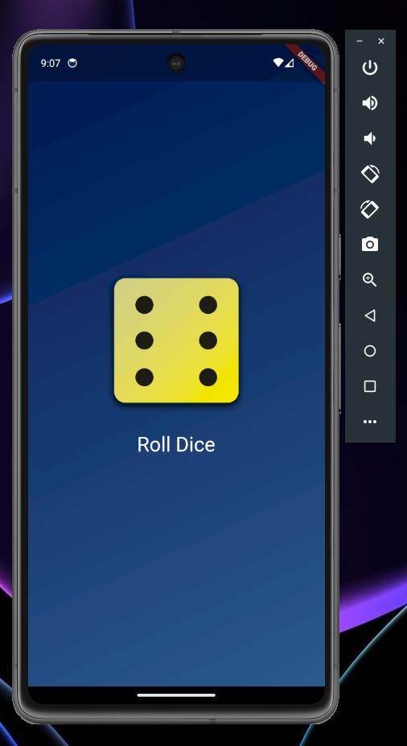

# Flutter Roll Dice App

This is a Flutter project that simulates rolling dice. The application allows the user to press a button that displays an image of a dice with a random value.

## Features

- Generation of a random value from 1 to 6
- Visualization of the dice image
  
## Packages

- Flutter (3.13.6): material
- Dart: math

## How to Use

1. Clone the repository to your local environment.
2. Make sure you have the Flutter development environment set up.
3. Run the application with the command `flutter run`.

## Screenshots

## Requirements

- Installed and configured Flutter SDK.

## Contribution

Feel free to open an Issue or submit a Pull Request with improvements or fixes.

*This project is part of section 2 of the "<a href="https://www.udemy.com/course/learn-flutter-dart-to-build-ios-android-apps/" target="_blank">Flutter & Dart - The Complete Guide [2023 Edition]</a>" course available on the Udemy platform.*
